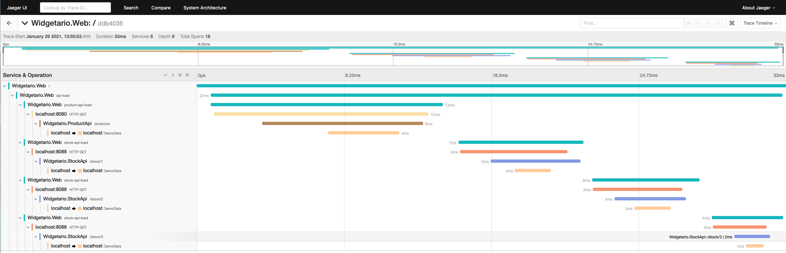
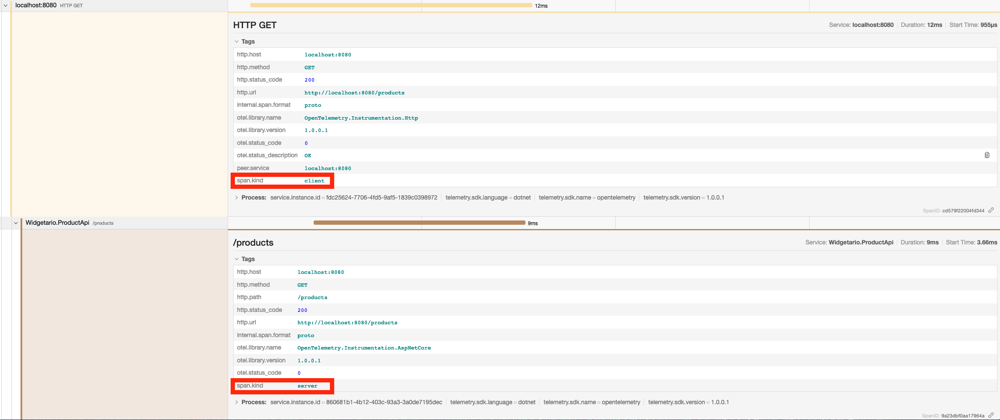

# ASP.NET Core, Carter, OpenTelemetry & Jaeger

## Tracing

When running an ASP.NET Core application that makes any IO calls it's handy to trace what is happening.  In this codebase, tracing is enabled and the ASP.NET Core web app makes IO calls to two different
APIs to retrieve data.  In the past we have had to wire up correlation ids and causation ids manually with HttpClient but thanks to the work done inside the .NET Core platform we no longer have to worry 
about this.  What's more we have tools that can use these enhancements and visualize these calls and allow us to see how long and where these calls take place inside our application.  It can also show any 
logging you may have in the app (via `ILogger`) and also distinguish HTTP calls going out and HTTP calls coming in across boundaries.  If you use SqlClient you also get OpenTelemetry for free that shows the timings
of your SQL queries and the SQL statement that was executed.  For this example, there are two options configured in the Product and Stock appsettings.json, SqlClient and Npgsql, unfortunately work to get 
OpenTelemetry into Npgsql is ongoing and therefore won't show sql timings.

**Overview**


**Cross Boundary**


**SQL**


## Running

Open a terminal 

Enter the `./src/db` directory 

### Postgres

Run `docker build -t widgetario/products-db:postgres .`

Run `docker run -p 5432:5432 -d --rm widgetario/products-db:postgres`


### MSSQL

Run `docker build -t db-demo .`

Run `docker run -p 1433:1433 -d --rm db-demo` (wait 20 secs for database initialization)

### Jaeger

Run
```
docker run -d --name jaeger \                                                                                                                                                                                                          18:55:31
-e COLLECTOR_ZIPKIN_HTTP_PORT=9411 \
-p 5775:5775/udp \
-p 6831:6831/udp \
-p 6832:6832/udp \
-p 5778:5778 \
-p 16686:16686 \
-p 14268:14268 \
-p 14250:14250 \
-p 9411:9411 \
jaegertracing/all-in-one:1.21
```

Open Rider, select `All` in the run/debug configuration and run or debug the apps
